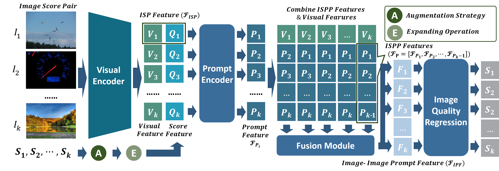
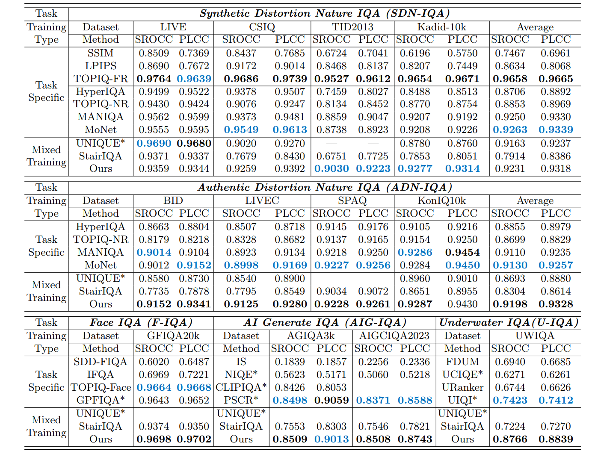

# PromptIQA: Boosting the Performance and Generalization for No-Reference Image Quality Assessment via Prompts

- The 18th European Conference on Computer Vision ECCV 2024

[Zewen Chen](https://zwchen.top/), Haina Qin, [Jun Wang](), **[Chunfeng Yuan]()**, [Bing Li]()

National Laboratory of Pattern Recognition, Institute of Automation, Chinese Academy of Sciences (NLPR, CASIA).

---

:rocket:  :rocket: :rocket: **News:**
- To be updated...
- ✅ **September, 2024**: We pubulish the online demo.
- ✅ **March, 2024**: We created this repository.

[]()
[](https://github.com/chencn2020/PromptIQA/releases)
[](https://github.com/chencn2020/PromptIQA/issues)
[](https://github.com/chencn2020/PromptIQA/issues)
[]([http://111.0.123.204:8000/](https://huggingface.co/spaces/Zevin2023/PromptIQA)) 
[](https://github.com/chencn2020/PromptIQA)

[Online Demo[TBU]]()

## Checklist

- [] Code for PromptIQA
- [] Code for training
- [] Code for testing
- [] Checkpoint
- [x] [Online Demo](https://huggingface.co/spaces/Zevin2023/PromptIQA) on huggingface

## Catalogue
1. [Introduction](#Introduction)
2. [Try Our Demo](#Demo)
3. [Usage For Training](#Training)
4. [Usage For Testing](#Testing)
5. [Results](#Results)
6. [Citation](#Citation)
7. [Acknowledgement](#Acknowledgement)


## Introduction
<div id="Introduction"></div>

This is an official implementation of **PromptIQA: Boosting the Performance and Generalization for No-Reference Image Quality Assessment via Prompts** by Pytorch.

---

> Due to the diversity of assessment requirements in various application scenarios for the IQA task, existing IQA methods struggle to directly adapt to these varied requirements after training. Thus, when facing new requirements, a typical approach is fine-tuning these models on datasets specifically created for those requirements. However, it is time-consuming to establish IQA datasets. In this work, we propose a Prompt-based IQA (PromptIQA) that can directly adapt to new requirements without fine-tuning after training. On one hand, it utilizes a short sequence of Image-Score Pairs (ISP) as prompts for targeted predictions, which significantly reduces the dependency on the data requirements. On the other hand, PromptIQA is trained on a mixed dataset with two proposed data augmentation strategies to learn diverse requirements, thus enabling it to effectively adapt to new requirements. Experiments indicate that the PromptIQA outperforms SOTA methods with higher performance and better generalization. 

<div style="display: flex; justify-content: center;">
    
</div>
<div style="font-size: large; text-align: center;">
    <p>Figure1: The framework of the proposed PromptIQA.</p>
</div>

## Try Our Demo 🕹️
<div id="Demo"></div>

**Click** 👇 **to try our demo online.**

[**web demo**](https://huggingface.co/spaces/Zevin2023/PromptIQA)


<table>
  <tr>
    <td style="text-align: center"><br>Point<br></td>
    <td></td>
  </tr>
    <tr>
    <td style="text-align: center"><br>Box<br></td>
    <td></td>
  </tr>
   </tr>
    <tr>
    <td style="text-align: center"><br>Everything<br></td>
    <td></td>
  </tr>
</table>


## Usage For Training
<div id="Training"></div>

### Preparation

The dependencies for this work as follows:

```commandline
TBU
```

You can also run the following command to install the environment directly:

```commandline
TBU
```

---

You can download the total 12 datasets from the following download link. (TBU)


<table>
    <thead>
        <tr>
            <th>Dataset</th>
            <th>Task</th>
            <th>Ref. Image</th>
            <th>Dist. Types</th>
            <th>Image Number</th>
            <th>Label Type</th>
            <th>Range</th>
            <th>Download</th>
        </tr>
    </thead>
    <tbody>
        <tr>
            <td>LIVE</td>
            <td  rowspan="4">Synthetic Distortion <br>Nature IQA</td>
            <td>29</td>
            <td>5</td>
            <td>779</td>
            <td>DMOS</td>
            <td>[1, 100]</td>
            <td></td>
        </tr>
        <tr>
            <td>CSIQ</td>
            <td>30</td>
            <td>6</td>
            <td>866</td>
            <td>DMOS</td>
            <td>[0, 1]</td>
            <td></td>
        </tr>
        <tr>
            <td>TID2013</td>
            <td>25</td>
            <td>24</td>
            <td>3,000</td>
            <td>MOS</td>
            <td>[0, 9]</td>
            <td></td>
        </tr>
        <tr>
            <td>Kadid-10k</td>
            <td>81</td>
            <td>25</td>
            <td>10,125</td>
            <td>MOS</td>
            <td>[1, 5]</td>
            <td></td>
        </tr>
        <tr>
            <td>BID</td>
            <td rowspan="4">Authentic Distortion <br>Nature IQA</td>
            <td>-</td>
            <td>-</td>
            <td>586</td>
            <td>MOS</td>
            <td>[0, 5]</td>
            <td><a href="https://github.com/zwx8981/UNIQUE#link-to-download-the-bid-dataset" target="_blank">Link</a></td>
        </tr>
        <tr>
            <td>SPAQ</td>
            <td>-</td>
            <td>-</td>
            <td>11,125</td>
            <td>MOS</td>
            <td>[0, 100]</td>
            <td> <a href="https://github.com/h4nwei/SPAQ" target="_blank">Link</a>    </td>
        </tr>
        <tr>
            <td>LIVEC</td>
            <td>-</td>
            <td>-</td>
            <td>1,162</td>
            <td>MOS</td>
            <td>[1, 100]</td>
            <td><a href="https://live.ece.utexas.edu/research/ChallengeDB/index.html" target="_blank">Link</a> </td>
        </tr>
        <tr>
            <td>KonIQ-10K</td>
            <td>-</td>
            <td>-</td>
            <td>10,073</td>
            <td>MOS</td>
            <td>[0, 100]</td>
            <td><a href="http://database.mmsp-kn.de/koniq-10k-database.html" target="_blank">Link</a> </td>
        </tr>
        <tr>
            <td>GFIQA20k</td>
            <td>Face IQA</td>
            <td>-</td>
            <td>-</td>
            <td>19,988</td>
            <td>MOS</td>
            <td>[0, 1]</td>
            <td></td>
        </tr>
        <tr>
            <td>AGIQA3k</td>
            <td rowspan="2">AI generated IQA</td>
            <td>-</td>
            <td>-</td>
            <td>2,982</td>
            <td>MOS</td>
            <td>[0, 1]</td>
            <td></td>
        </tr>
        <tr>
            <td>AIGCIQA2023</td>
            <td>-</td>
            <td>-</td>
            <td>2,400</td>
            <td>MOS</td>
            <td>[0, 1]</td>
            <td></td>
        </tr>
        <tr>
            <td>UWIQA</td>
            <td>Underwater IQA</td>
            <td>-</td>
            <td>-</td>
            <td>890</td>
            <td>MOS</td>
            <td>[0, 1]</td>
            <td></td>
        </tr>
    </tbody>
</table>

### Training process

1. You should replace the dataset path in [dataset_info.json](./utils/dataset/dataset_info.json) to your own dataset path.
2. Run the following command to train the PromptIQA (Please review the [train.py](train.py) for more options).
```commandline
TBU
```


## Usage For Testing
<div id="Inference"> </div>


## Results
<div id="Results"> </div>

We achieved state-of-the-art performance on most IQA datasets simultaniously within one single model. 

More detailed results can be found in the [paper](). 

<div style="display: flex; justify-content: center;">
    
</div>
<div style="font-size: large; text-align: center;">
    <p>Individual Dataset Comparison.</p>
</div>


## Citation
<div id="Citation"> </div>

If our work is useful to your research, we will be grateful for you to cite our paper:


## Acknowledgement
<div id="Acknowledgement"></div>

We sincerely thank the great work [HyperIQA](https://github.com/SSL92/hyperIQA), [MANIQA](https://github.com/IIGROUP/MANIQA) and [MoCo](https://github.com/facebookresearch/moco). 
The code structure is partly based on their open repositories.
